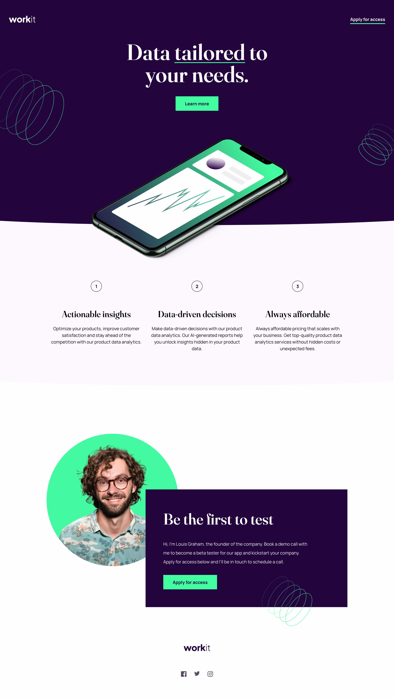

# Frontend Mentor - Workit landing page solution

This is a solution to the [Workit landing page challenge on Frontend Mentor](https://www.frontendmentor.io/challenges/workit-landing-page-2fYnyle5lu). Frontend Mentor challenges help you improve your coding skills by building realistic projects.

## Table of contents

- [Overview](#overview)
  - [The challenge](#the-challenge)
  - [Screenshot](#screenshot)
  - [Links](#links)
- [My process](#my-process)
  - [Built with](#built-with)
  - [What I learned](#what-i-learned)
  - [Continued development](#continued-development)
- [Author](#author)

## Overview

### The challenge

Users should be able to:

- View the optimal layout for the interface depending on their device's screen size
- See hover and focus states for all interactive elements on the page

### Screenshot



### Links

- Solution URL: [Add solution URL here](https://your-solution-url.com)
- Live Site URL: [Add live site URL here](https://your-live-site-url.com)

## My process

### Built with

- Semantic HTML5 markup
- CSS custom properties
- Flexbox
- CSS Grid
- Mobile-first workflow

### What I learned

I practiced responsive layout using grid. specially in the founder section where there is the portrait and a box of content overlapping the image. I can use a grid and set the two items on the same column and same row.

Using background image on the hero section for the spiral illustration. I can call several images and set their individual position.

```css
.hero {
  background-image: url(../assets/images/bg-pattern-1.svg),
    url(../assets/images/bg-pattern-2.svg);
  background-repeat: no-repeat;
  background-position: calc(0% - 10rem), calc(100% + 5rem) calc(100% - 5rem);
}
```

### Continued development

Finetune the css to match the design

## Author

- Website - [Gwenaël Magnenat](https://gmagnenat.com)
- Frontend Mentor - [@gmagnenat](https://www.frontendmentor.io/profile/gmagnenat)
- LinkedIn - [@gmagnenat](https://linkedin.com/in/gmagnenat)
